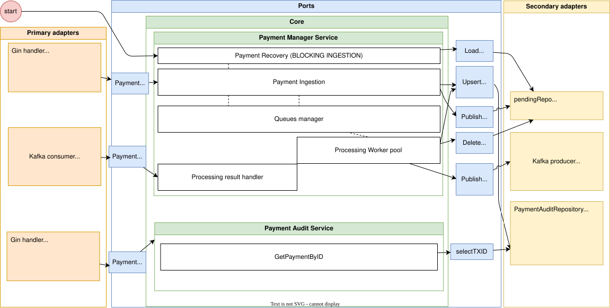

# Payment instruction management service

queue management and execution of payment instructions.

## Use-cases

- UC-01: Execute payment instruction
The external system transmits a payment instruction; the service accepts it and guarantees execution.
- UC-02: Get payment instruction status
The external system requests the current status of a previously transmitted instruction.

## Non functional req

- Fault Tolerance S

## Arhitecture

C4 - Context Map


C4 - container Diagram


**Component draft**



## Invariants

1. (1:1) REST Request : PaymentTx
1. (1:1) PA : PaymentTx

## Agregats

### Payment Transaction (PaymentTx)

```
ID:                         TXID (ISO 20022) 
status (VO):                (pending → processing → completed / failed)
amount:                     decimal.Decimal (NUMERIC)
currency(VO):               char(len 3)
endToEndIdentification(VO): string(len 1-35) {prefix}.{YYYYMMDD}.{seq}  (ISO 20022)
transactionType:            int(len 3)
debitorPAccID:              IBAN
creditorPAccID:             IBAN

Metadata (VO):              Created_at (), updated_at() 
```

### Payment Party

```
ID:                     BIC
role(VO):               debitor/creditor 
countryOfResidence(VO): char(len 2)(ContryCode  ISO 3166-1 alpha-2.)
name:                   string -not safe typing with `` and other
```

### Payment account (PA)

```
ID:     IBAN 
Account currency(VO): char(len 3)
```
## ER

ER diagram(without outbox)


