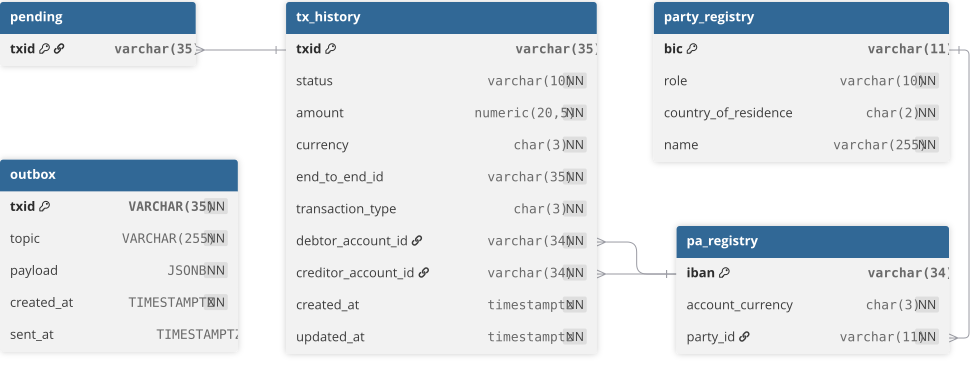
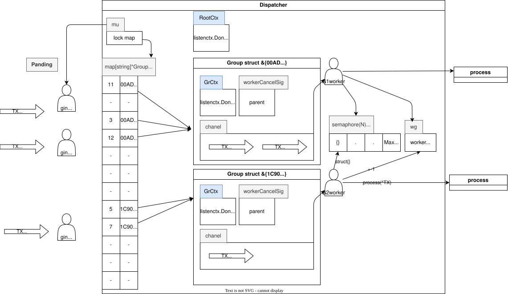

# Payment instruction management service

queue management and execution of payment instructions.

## Functional Requirements

1. HTTP REST API for receiving payment instructions
2. Automatic initiation of payment processing when a processing slot becomes available
3. Invocation of a handler stub (`processPayment`) simulating actual work (2–5 second delay, 10% error rate)
4. Payment status updates: `pending` → `processing` → `completed` / `failed`
5. Endpoint to retrieve payment status by ID
6. Queue recovery from the database upon service restart (all `pending` payments)
7. Graceful shutdown – completion of ongoing payments before stopping№№

## Use-cases

- UC-01: Execute payment instruction
The external system transmits a payment instruction; the service accepts it and guarantees execution.
- UC-02: Get payment instruction status
The external system requests the current status of a previously transmitted instruction.

## Non functional req

- Fault Tolerance S

## Deploy

[deploy](./docs/Deployment.md)

## Agregats

### Payment Transaction (PaymentTx)

```
ID:                         TXID (ISO 20022) 
status (VO):                (pending → processing → completed / failed)
amount:                     decimal.Decimal (NUMERIC)
currency(VO):               char(len 3)
endToEndIdentification(VO): string(len 1-35) {prefix}.{YYYYMMDD}.{seq}  (ISO 20022)
transactionType:            int(len 3)
debtorPAccID:              IBAN
creditorPAccID:             IBAN

Metadata (VO):              Created_at (), updated_at() 
```

### Payment Party

```
ID:                     BIC
role(VO):               debtor/creditor 
countryOfResidence(VO): char(len 2)(ContryCode  ISO 3166-1 alpha-2.)
name:                   string -not safe typing with `` and other
```

### Payment account (PA)

```
ID:     IBAN 
Account currency(VO): char(len 3)
```

## Kafka Topology

Two topics are used for async communication between the payment service and the processing system

**payment.processing.request**
Produced by the payment service. Contains payment details sent to the processing system for execution

type TXRequest struct {
 TXID                   string
 Status                 string
 Amount                 decimal.Decimal
 Currency               string
 EndToEndIdentification string
transactionType string
 DebtorIBAN            string
 CreditorIBAN           string
 Metadata               string
}


**payment.processing.response**  
Produced by the processing system. Contains the processing result (SUCCESS / FAILED ) matched by `paymentId`.

type PaymentResult struct {
 TXID     string
 Result   string
 Metadata string
}


Message key: `paymentId` — ensures ordered processing per payment within a single partition.

## ER

ER diagram


## Arhitecture

**C4 - Context Map**


**C4 - container Diagram**


**Component draft**

*Without outbox its logic stays in secondary adapter*


***

**Queue manager**

The service is built around a Dispatcher that routes payment transactions (TX) into isolated Groups based on shared IBANs. Each Group owns a dedicated worker goroutine that processes transactions strictly sequentially — guaranteeing that no two payments sharing a digital account (DA) are processed concurrently.

While holding the mutex, check if a group already exists for each of the two IBANs:

- both are nil — acquire a semaphore slot (semaphore ← struct{}{}), then re-check (TOCTOU!), create a newGroup, launch a worker via `go`, and call `wg.Add(1)`.
one already exists — simply associate the second IBAN with that same group.
- both are in the same group — no action needed.
- in different groups (MERGE) — call `gB.workerCancelSig()`, drain `gB.ch` into `gA.ch` while holding the mutex, and re-associate all IBANs. The `gB` worker will finish processing its current task and exit, releasing the semaphore slot.
After releasing the mutex — `g.ch ← tx`.

On any exit path, two deferred calls fire in order:

### GroupWorker
Each worker runs a single for / select loop

1. wg.Done() — decrements the WaitGroup counter.
2. <-semaphore — releases the worker slot back to the pool.

This ensures the semaphore slot is always released exactly once, regardless of how the worker exits.

### Graceful Shutdown
Shutdown follows a two-step protocol:

text

1. cancel() - cancels the Dispatcher's root context->  transitively cancels every Group's ctx via WithCancel(parent) -> each worker receives signal on g.ctx.Done() -> worker drains its buffer, then returns

2. d.wg.Wait() - blocks until every wg.Done() has been called -> close DB connections, release resources, exit

This satisfies the graceful shutdown requirement: all in-flight payments complete before the service stops.

